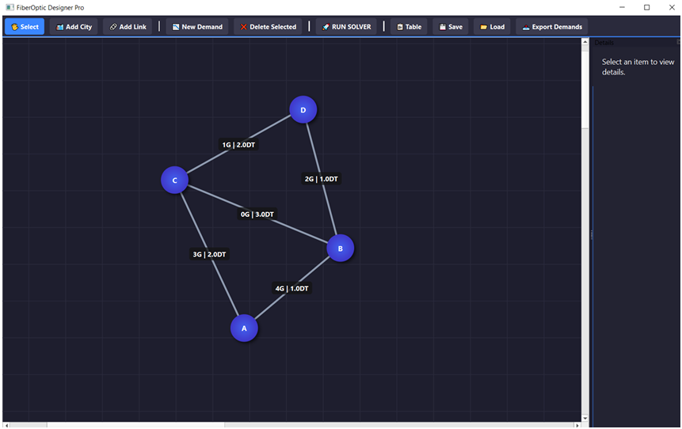
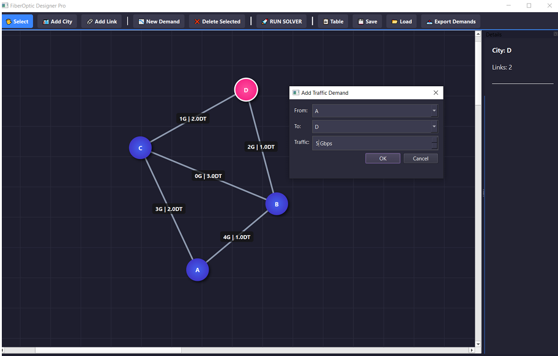
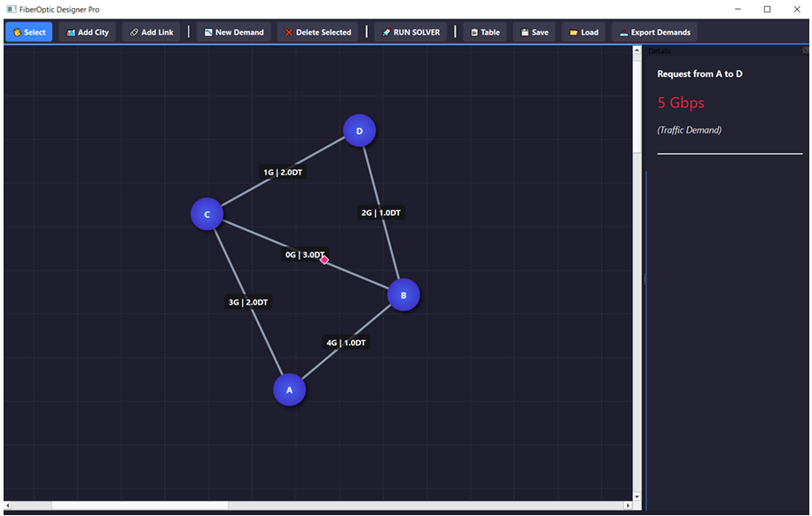
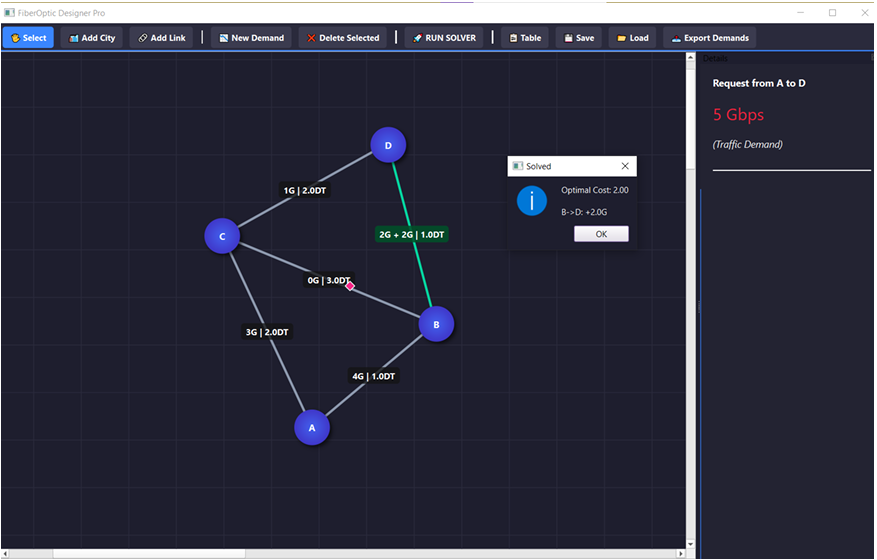
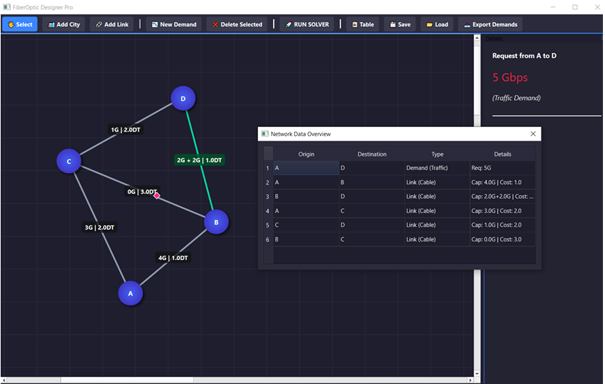

# Capacité de Réseau — Application PL

Application de bureau pour l'optimisation de la capacité d'un réseau de télécommunications
basée sur la programmation linéaire, visant à minimiser le coût des extensions de liens
sous contraintes de flux et de capacité.

---

## Table des matières

- [Modélisation mathématique](#-modélisation-mathématique)
- [Technologies](#-technologies)
- [Fonctionnalités](#-fonctionnalités)
- [Aperçu](#-aperçu)
- [Utilisation](#-utilisation)
- [Exemple de résultat](#-exemple-de-résultat)
- [Auteur](#-auteur)

---

## Modélisation mathématique

### Variables de décision
- `x(i,j)` : capacité supplémentaire à ajouter sur le lien (i, j)
- `f(k,p)` : flux de la demande k sur le chemin p choisi

### Paramètres
- `u(i,j)` : capacité existante du lien (i, j)
- `c(i,j)` : coût unitaire pour ajouter de la capacité sur le lien (i, j)
- `dk` : demande de trafic pour la paire de nœuds k

### Fonction objectif

Minimiser le coût total des capacités ajoutées :

$$\min Z = \sum_{(i,j) \in L} c_{i,j} \cdot x_{i,j}$$

### Contraintes

- La demande entre chaque paire de nœuds doit être entièrement satisfaite :

$$\sum_{p \in P_k} f_{k,p} = d_k \quad \forall k$$

- Le flux total sur chaque lien ne doit pas dépasser la capacité existante plus la capacité ajoutée :

$$\sum_{k} \sum_{p \ni (i,j)} f_{k,p} \leq u_{i,j} + x_{i,j} \quad \forall (i,j)$$

- Les flux doivent être non négatifs :

$$f_{k,p} \geq 0, \quad x_{i,j} \geq 0$$

---

##  Technologies

| Outil | Rôle |
|-------|------|
| Python | Langage principal |
| PyQt6 + QGraphicsScene / QGraphicsView | Interface graphique |
| Gurobi Optimizer | Solveur de programmation linéaire |
| CSV | Import / Export des données |

---

## Fonctionnalités

- **Topologie réseau** : créer et modifier des villes et des liens via l'interface graphique
- **Demandes de trafic** : définir des demandes entre paires de nœuds avec volume de trafic
- **Import / Export** : charger et sauvegarder les données au format CSV
- **Optimisation** : lancer le solveur Gurobi pour calculer les capacités minimales à ajouter
- **Visualisation** : affichage du coût optimal et mise à jour du réseau en temps réel
- **Tableau récapitulatif** : synthèse des liens, capacités ajoutées et coûts

---

##  Aperçu

### Topologie du réseau avec capacités et coûts initiaux

### Saisie d'une demande de trafic

### Confirmation et affichage de la demande dans le réseau

### Résultat de l'optimisation après exécution du solveur

### Tableau récapitulatifs

---

## Utilisation

### 1. Créer ou charger une topologie

Deux options disponibles :
- **Charger** une topologie existante depuis un fichier CSV via le bouton `Load`
- **Dessiner** manuellement un réseau en ajoutant des villes (`Add City`) et des liens (`Add Link`)

Chaque lien est défini par :
- une **capacité existante** `u(i,j)`
- un **coût unitaire d'extension** `c(i,j)`

### 2. Définir les demandes de trafic

Sélectionner deux villes et préciser le volume de trafic via le bouton `New Demand`.
Chaque demande correspond au paramètre `dk` du modèle.

### 3. Lancer le solveur

Cliquer sur **Run Solver**. Le solveur :
- construit automatiquement le modèle de programmation linéaire
- calcule les capacités minimales à ajouter sur chaque lien
- minimise le coût total d'investissement
- affiche la solution optimale sur le réseau

### 4. Analyser les résultats

Utiliser le bouton `Table` pour afficher le tableau récapitulatif des liens,
capacités ajoutées et coûts associés.

---

## Exemple de résultat

Pour une demande **A → D = 5** sur le réseau exemple :

| Chemin | Flux | Capacité ajoutée |
|--------|------|-----------------|
| A → B → D | 4 | +2 sur B→D |
| A → C → D | 1 | 0 |

**Coût total optimal : 2**

> La solution montre que fractionner le flux sur plusieurs chemins permet de minimiser le coût total.

---

## Auteur

**Mariem Elabed**  
INSAT — Diplôme National d'Ingénieur en Réseaux Informatiques et Télécommunications  
Année universitaire : 2025 – 2026
